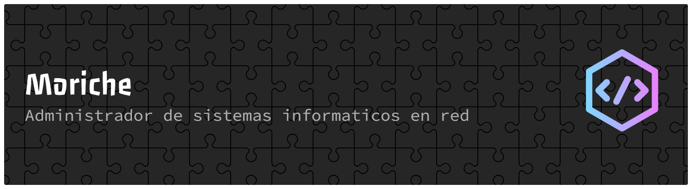

---

# 🖥️ SysAdmin | 🏗️ Infraestructura · 🌐 Redes · 🤖 Automatización

---

## 👤 Sobre mí

> Administrador de Sistemas especializado en **infraestructura**, **redes** y **automatización** ⚙️🌐🤖  
> Disfruto diseñando entornos estables, afinando procesos y convirtiendo tareas repetitivas en scripts que respiran elegancia 🛠️✨  
> Me siento en casa entre servidores, logs y despliegues 📡📜, pero también valoro la comunicación clara y los equipos que funcionan como un buen reloj.  
> Mi objetivo: que todo fluya, que nada falle… y que la tecnología trabaje a nuestro favor, no en contra 🚀🧩

---

# 🛠️ Habilidades Técnicas

### 🔝 **Principales**

  

---

### 🛜 **Redes e Infraestructura**

---

### 💾 **Bases de datos**

---

### 🧰 **Otros**

---

# 🚀 Proyectos Destacados *(en desarrollo)*

---

## 📌 Plataforma de Registro de Jugadores — *HTML · CSS · PHP · MySQL*

> Sistema completo para la gestión y registro de jugadores y tutores legales, con paneles, formularios, validaciones y generación de documentos.

---

## 📌 Panel de Administración y Control del Club — *PHP · SQL · Bootstrap*

> Herramienta para gestionar usuarios, categorías, jugadores, pagos, listados y estadísticas internas del club.

---

## 📌 API interna en Python para Automatización — *Python · FastAPI · SQLite*

> API ligera para automatizar procesos del club (actualización de datos, consultas, exportaciones y sincronización).

---

## 📌 Herramientas en Python y Boto3 para Automatizar AWS — *Python · Boto3*

> Colección de scripts para gestionar DynamoDB, S3, IAM y tareas de mantenimiento desde consola.

---

## 📌 Página Web Personal / Portfolio — *HTML · CSS · JS*

> Tu espacio personal para mostrar proyectos, contacto y un blog técnico.

---

# 📬 Contacto

---
